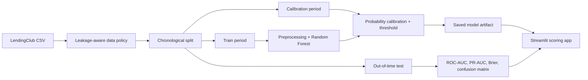

# Loan Default Risk Modeling

[](https://github.com/ESGT1299/Loan-Default-Prediction/actions/workflows/tests.yml)


An end-to-end credit-risk-style machine learning project that estimates default probability from information available near loan origination. It combines leakage-aware feature governance, chronological validation, probability calibration, model diagnostics, automated tests, and an interactive Streamlit application.

> The model is intended for analysis and demonstration. It is not validated for production lending decisions.

## Highlights

- Prevents post-origination target leakage through an explicit feature policy.
- Trained on earlier loans and tested only on newer 2017-2018 loans.
- Calibrated Random Forest probabilities using a separate calibration period.
- Selected an operating threshold without using the final test set.
- Added model diagnostics, global explainability, governance documentation, tests, and CI.

## Architecture



## Why This Project Matters

Credit risk models can look impressive if they accidentally use information from the future. For example, fields such as `recoveries`, `total_pymnt`, `last_pymnt_d`, and `total_rec_prncp` are often known only after the loan has been serviced. Including them can inflate accuracy while making the model unusable for real loan approval or early risk scoring.

This version focuses on a cleaner question:

> Given loan and borrower information available at origination, can we estimate the probability that a loan will default?

## Capabilities

- Binary classification: `default` vs. `non_default`
- Resolved LendingClub outcomes only:
  - Default: `Charged Off`, `Default`
  - Non-default: `Fully Paid`
- Conservative origination-time feature list
- Explicit leakage-column blocklist
- Scikit-learn preprocessing and model pipeline
- Chronological train/calibration/test split
- Calibrated default probabilities
- Permutation-based global feature importance
- Streamlit scoring app
- Model performance dashboard
- Unit tests for leakage policy, temporal splitting, and threshold selection

## Project Structure

```text
Loan-Default-Prediction/
+-- app.py
+-- data_cleaning.py
+-- data_exploration.py
+-- model_training.py
+-- requirements.txt
+-- docs/
|   +-- model_card.md
+-- src/
|   +-- loan_default_risk/
|       +-- data.py
|       +-- features.py
|       +-- modeling.py
+-- tests/
    +-- test_feature_policy.py
```

## Dataset

The original dataset is the LendingClub accepted loans dataset available on Kaggle:

[Kaggle LendingClub Dataset](https://www.kaggle.com/datasets/wordsforthewise/lending-club)

The raw dataset is not stored in this repository. Download the accepted-loans file and place it in an ignored local directory:

```text
dataset/
+-- accepted_2007_to_2018Q4.csv
```

The trained model artifact required by the Streamlit demo is versioned in `artifacts/`. Raw data and generated exploratory outputs remain excluded from Git.

## Feature Policy

The model uses an explicit allowlist of origination-time fields such as:

- `loan_amnt`
- `term`
- `int_rate`
- `installment`
- `grade`
- `sub_grade`
- `annual_inc`
- `dti`
- `fico_range_low`
- `fico_range_high`
- `revol_util`
- `purpose`
- `home_ownership`

The project blocks known leakage fields such as:

- `total_pymnt`
- `recoveries`
- `last_pymnt_d`
- `last_pymnt_amnt`
- `total_rec_prncp`
- `total_rec_int`
- `out_prncp`
- `settlement_*`

This is the most important modeling decision in the project.

## Installation

```bash
git clone https://github.com/ESGT1299/Loan-Default-Prediction.git
cd Loan-Default-Prediction
python -m venv .venv
```

Activate the environment before installing dependencies:

```powershell
# Windows PowerShell
.\.venv\Scripts\Activate.ps1
```

```bash
# macOS or Linux
source .venv/bin/activate
```

```bash
pip install -r requirements.txt
```

## Quick Start

The repository includes the trained model artifact, so the dashboard can run without downloading the full dataset:

```bash
streamlit run app.py
```

The Kaggle dataset is only required when reproducing training or exploratory analysis.

## Reproduce the Analysis

Prepare a cleaned modeling file:

```bash
python data_cleaning.py --data "dataset/accepted_2007_to_2018Q4.csv" --output "dataset/cleaned_originated_loans.csv"
```

Train the model:

```bash
python model_training.py --data "dataset/accepted_2007_to_2018Q4.csv"
```

For a quick smoke test on a smaller subset:

```bash
python model_training.py --data "dataset/accepted_2007_to_2018Q4.csv" --sample-size 50000
```

Reproduce the saved model artifact:

```bash
python model_training.py --data "dataset/accepted_2007_to_2018Q4.csv" --sample-size 100000
```

Generate the exploratory summary and charts:

```bash
python data_exploration.py --data "dataset/accepted_2007_to_2018Q4.csv" --sample-size 50000
```

The app includes example borrower profiles. Select a profile and adjust individual fields to observe how the estimated probability changes. Monthly installment is calculated from loan amount, interest rate, and term.

The output is an estimated default probability. For example, a score of `35%` means the model estimates that this profile resembles historical default-like loans with roughly that level of risk. It is a risk analysis signal, not an automatic approve/deny decision.

## Evaluation

The training script reports metrics that are more useful for credit-style risk modeling than accuracy alone:

- ROC-AUC
- PR-AUC
- Brier score
- Classification report
- Confusion matrix
- Calibration curve
- Default-class threshold

Accuracy is intentionally not the headline metric because default data is often imbalanced. A model can appear accurate while missing many defaults.

### Final Out-of-Time Results

The saved artifact was trained from a uniform 100,000-row source sample. After keeping only resolved loan outcomes, 59,738 loans remained.

| Metric | Result |
|---|---:|
| ROC-AUC | 0.699 |
| PR-AUC | 0.368 |
| Brier score | 0.153 |
| Default threshold | 0.243 |
| Default precision | 0.322 |
| Default recall | 0.683 |
| Default F1 | 0.437 |

The chronological periods are:

- Train: July 2007 to February 2016
- Calibration: March 2016 to January 2017
- Test: February 2017 to December 2018

The final test represents newer loans that were not used for training, calibration, or threshold selection.

## Tests

```bash
python -m unittest discover -s tests
```

The current tests verify:

- known leakage fields are excluded from the origination feature list
- leakage fields are rejected if accidentally added
- loan statuses map correctly to binary targets
- percentage strings are parsed consistently
- chronological splits preserve time order
- selected thresholds remain valid probabilities

GitHub Actions runs the unit tests and Python compilation checks on every push and pull request.

## Limitations

- The output is not financial, legal, or credit advice.
- The model has not been validated for production lending decisions.
- Fair lending, bias testing, adverse action explanations, monitoring, and governance are not fully implemented.
- Feature availability should be verified against the exact business decision point.
- Accepted-loan data contains selection bias because rejected applicants do not have observed repayment outcomes.
- Global feature importance is not a causal or applicant-specific explanation.

## Potential Extensions

- Add subgroup fairness and stability analysis
- Add applicant-level explanations with carefully validated reason codes
- Add Docker packaging and hosted demo deployment
- Compare the Random Forest against a calibrated logistic-regression baseline

## Model Governance

See [docs/model_card.md](docs/model_card.md) for intended use, methodology, performance, limitations, and controls required before any production use.
